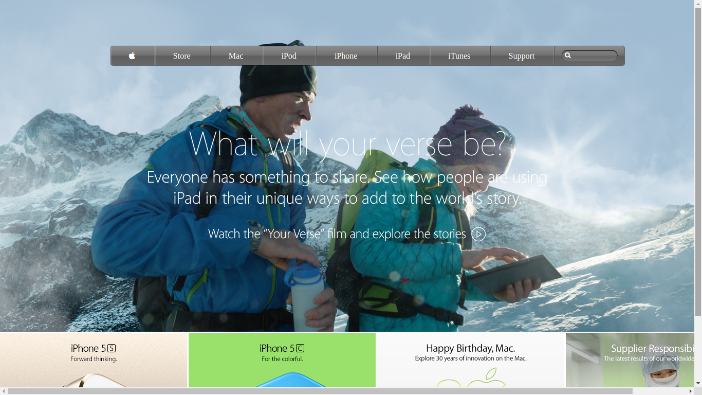

# building-with-backgrounds-and-gradients

> This project consists of building an HTML document that matches the appearance of Apple.com.

Use of Background image and linear gradient color.

## Built With

- HTML, CSS.
## Live Demo

[Live Demo Link](https://rawcdn.githack.com/hemant-soni-vst-au4/building-with-backgrounds-and-gradients/7bcc4e3e2e1318b855b31092d88096e2b202cad0/index.html)

## Authors

👤 **Hemant soni**

- Github: [@githubhandle](https://github.com/hemant-soni-vst-au4)
- Twitter: [@twitterhandle](https://twitter.com/abdelperez11)
- Linkedin: [linkedin](https://www.linkedin.com/in/hemant-soni-97427b193/)

## 🤝 Contributing

Contributions, issues and feature requests are welcome!

Feel free to check the [issues page](https://github.com/hemant-soni-vst-au4/building-with-backgrounds-and-gradients/issues).

## Show your support

Give a ⭐️ if you like this project!
